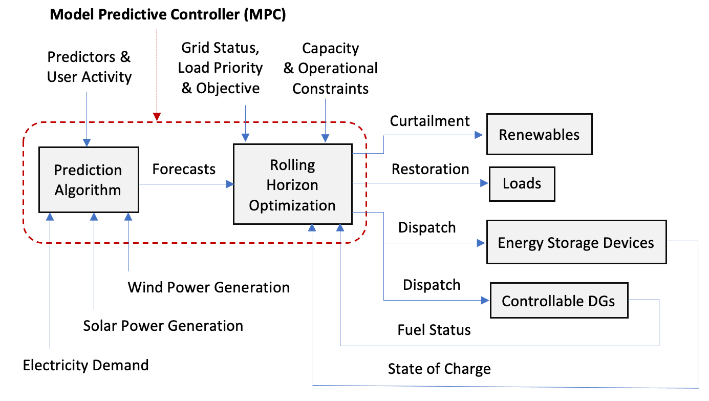
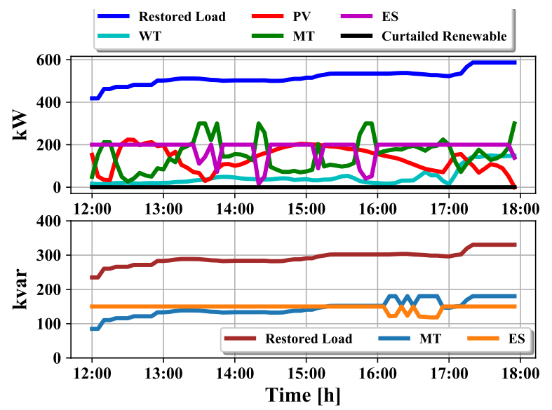
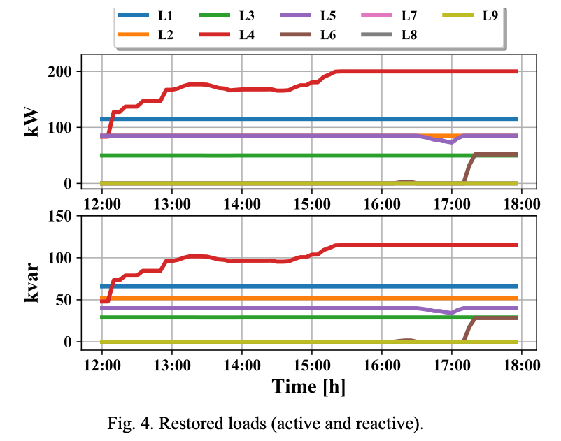

# MPC4CLR Overview

MPC4CLR is a Julia- and Python-based software package for the application of model predictive control (MPC) for critical load restoration (CLR) in power distribution systems. 



Fig. 1. MPC architecture and data flow.

# Installation

- MPC4CLR is a Julia-Python package and therefore requires Julia and Python installations.

- MPC4CLR requires a number of Python and Julia packages to be installed in your machine. We recommend first to create an Anaconda environment, with a Python installation, to install all these packages in one place for this purpose, run the following command from your terminal (or the Anaconda prompt for Windows users):

    ```
    conda create -n mpc-clr python=3.8
    ```
    where 'mpc-clr' is the name of the Anaconda environment. You can change this name as you would like. 

- Activate the created Anaconda environment, as follows:

    ```
    conda activate mpc-clr
    ```

- Execute setup.py, from the root of the repo, to install MPC4CLR into your Anaconda environment. Use the command below from your terminal:

    ```
    python setup.py develop
    ```

    You will get a message saying "Finished processing dependencies for mpc4clr==0.0.1" if your installation is successful.

# Requirements

Install the following packages in addition to those you have installed with the setup.py file.

- Julia

    Get the Julia installer from https://julialang.org/downloads/. 

    After the Julia installation, your python installation (the Anaconda environment) must be able to call command line program julia. You can check this with the following command:

    ```
    julia
    ```

    If a Julia session does not open this may be due to your environment does not add the Julia binary directory to your PATH, you will have to add it. To fix this: First find out the location of the Julia binary executable file in your machine (Julia is usually installed in "/Applications" in Mac OS). Then create a link to the executable and save it into the "/usr/local/bin" directory (which should already be in your path), so that typing julia is the exact equivalent of typing "/Applications/Julia/.../julia", using the following command from your terminal:

    ```
    ln -fs "/Applications/Julia-1.4.app/Contents/Resources/julia/bin/julia" /usr/local/bin/julia
    ```

    Please specify exactly your installed Julia version in the above command (for example if you have installed Julia v1.7.1 then Julia-1.4 should be replaced with Julia-1.7). 

    You should now be able to open a Julia session (julia> ) when you type julia from your terminal and hit the enter key.

    Exit from the julia session with:

    ```
    exit()
    ```

- PyJulia

    MPC4CLR executes the load restoration optimization model written in Julia/JuMP from Python using the PyJulia package. Run the following command to install PyJulia onto your Anaconda environment:

    ```
    pip install julia
    ```

- Julia packages 

    Launch a Julia session (Julia REPL) by typing julia from your terminal and run the following commands one-by-one using Julia’s builtin package manager (Pkg) to install the Julia packages that MPC4CLR requires:

    ```
    julia> using Pkg

    julia> Pkg.add("PyCall")

    julia> Pkg.add("JuMP")

    julia> Pkg.add("Cbc")

    julia> Pkg.add("CSV")

    julia> Pkg.add("DataFrames")

    julia> Pkg.add("LinearAlgebra")
    ```

# Testing The Installation

- To test the some of the elements and functions of the MPC4CLR, run the following commands one-by-one from the "...tests" sub-directory:

    ```
    pytest test_bus.py
    pytest test_branch.py
    pytest test_load.py
    pytest test_DER.py
    pytest test_network_topology.py   
    ```

# Running Experiments

- MPC4CLR contains the following four simulation experiments/cases:

    - Copper plate distribution grid test system
    - Three-phase balanced distribution grid test system
    - Three-phase balanced distribution grid test system with reserves (co-optimization of power and reserve products of DERs)
    - Multi-phase unbalanced distribution grid test system
    
- To run the copper plate test system, execute the following command on your terminal from the ".../mpc_copper_plate_system" sub-directory:

    ```
    python simulate_mpc_copper_plate_system.py
    ```
- To run the three-phase balanced distribution grid test system, execute the following command on your terminal from the ".../mpc_three_phase_balanced_system" sub-directory:

    ```
    python simulate_mpc_three_phase_balanced_system.py
    ```

- To run the three-phase balanced distribution grid test system with reserves, execute the following command on your terminal from the ".../mpc_with_reserve" sub-directory:

    ```
    python simulate_mpc_three_phase_balanced_system_with_reserve.py
    ```

- To run the multi-phase unbalanced distribution grid test system, execute the following command on your terminal from the ".../mpc_multi_phase_unbalanced_system" sub-directory:

    ```
    python simulate_mpc_multi_phase_unbalanced_system.py
    ```

# Examples of Simulation Results

The figure below shows the active and reactive power dispatch and total restored load obtained from running the three-phase balanced distribution grid test system with reserves. 



Fig. 2. Active (kW) and reactive (kvar) power dispatch and aggregate load restoration. WT = Wind generator, PV = Photovoltaic solar, MT = Microturbine generator, ES = Energy storage battery.

The figure below depicts the active and reactive individual restored loads obtained from running the three-phase balanced distribution grid test system with reserves.



Fig. 3. Restored loads (active and reactive). L1 to L9 = Loads 1 to 9, where the priority of the loads descreases from L1 to L9.

# Citing The Project

All publications derived from the use of MPC4CLR should cite the following two papers:

1. Abinet Tesfaye Eseye, Bernard Knueven, Xiangyu Zhang, Matthew Reynolds, and Wesley Jones, "Resilient Operation of Power Distribution Systems Using MPC-based Critical Service Restoration," IEEE GreenTech 2021, April 2021. DOI: https://doi.org/10.1109/GreenTech48523.2021.00054.

2. Abinet Tesfaye Eseye, Xiangyu Zhang, Bernard Knueven, and Wesley Jones, "Enhancing Distribution Grid Resilience Through Model Predictive Controller Enabled Prioritized Load Restoration Strategy," IEEE NAPS 2020, April 2021. DOI: https://doi.org/10.1109/NAPS50074.2021.9449732.